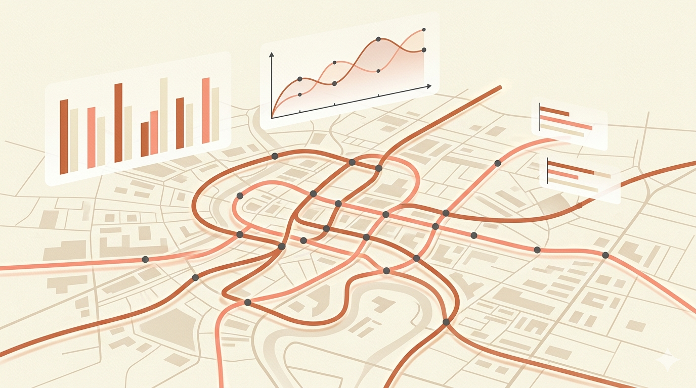

# Image Generation Prompts for Super AI Engineer S6 Showcase

Use these prompts with Nanobanana Pro to generate hero images and illustrations for each page. All images should follow a consistent warm, minimal, professional aesthetic that matches the website's parchment/terracotta color palette.

---

## Global Style Guide

For all prompts below, append this style suffix to ensure visual consistency:

> **Style suffix:** `Minimal flat illustration, warm color palette with parchment cream (#f5f4ed), terracotta (#c96442), soft coral, and charcoal accents. Clean geometric shapes, no text, no people's faces. Subtle grain texture. Wide aspect ratio 16:9. Professional, modern, editorial feel.`

---

## 1. Homepage Hero Image

**Filename:** `hero-main.png`
**Where it goes:** index.html — hero section background or above the fold
**Size:** 1200 x 630px (or 16:9)

**Prompt:**
```
An abstract composition representing artificial intelligence and engineering excellence. Interconnected geometric nodes and flowing data streams form a subtle brain-like pattern. Warm gradients from parchment cream to soft terracotta. Floating geometric shapes — hexagons, circles, and neural network lines — arranged in an elegant, spacious layout. Minimal flat illustration, warm color palette with parchment cream (#f5f4ed), terracotta (#c96442), soft coral, and charcoal accents. Clean geometric shapes, no text, no people's faces. Subtle grain texture. Wide aspect ratio 16:9. Professional, modern, editorial feel.
```

---

## 2. Hack 1: ชีพจรกรุงเทพฯ (Data Storytelling)

**Filename:** `hero-hack1.png`
**Where it goes:** hackathon1.html — hero section
**Size:** 1200 x 630px

**Prompt:**
```
Abstract data visualization of a city transit system from a bird's eye view. Stylized train routes forming elegant curves across a minimal city grid. Bar charts and line graphs float above the cityscape like gentle overlays. Warm tones — cream background with terracotta and coral lines representing different rail routes (BTS, MRT, ARL). Small dots represent stations connected by flowing curved lines. Minimal flat illustration, warm color palette with parchment cream (#f5f4ed), terracotta (#c96442), soft coral, and charcoal accents. Clean geometric shapes, no text, no people's faces. Subtle grain texture. Wide aspect ratio 16:9. Professional, modern, editorial feel.
```

---

## 3. Hack 2: Election OCR Pipeline

**Filename:** `hero-hack2.png`
**Where it goes:** hackathon2.html — hero section
**Size:** 1200 x 630px

**Prompt:**
```
Abstract illustration of a document processing pipeline. On the left, a stylized paper document with faint grid lines and handwritten marks. In the middle, five translucent versions of the same document fan out like playing cards, each with different visual treatments (contrast, threshold, sharpen). On the right, clean structured data rows emerge from a funnel shape. Arrows flow left to right showing the transformation pipeline. Minimal flat illustration, warm color palette with parchment cream (#f5f4ed), terracotta (#c96442), soft coral, and charcoal accents. Clean geometric shapes, no text, no people's faces. Subtle grain texture. Wide aspect ratio 16:9. Professional, modern, editorial feel.
```

---

## 4. Hack 3: FahMai RAG System

**Filename:** `hero-hack3.png`
**Where it goes:** hackathon3.html — hero section
**Size:** 1200 x 630px

**Prompt:**
```
Abstract illustration of a retrieval-augmented generation system. A large knowledge base represented as stacked document layers on the left. In the center, a search beam/spotlight highlights specific documents. On the right, multiple AI model icons (simple geometric brain shapes) receive the retrieved documents and vote — represented by converging arrows pointing to a single answer node. The flow goes: question bubble -> search -> documents -> multiple models -> answer. Minimal flat illustration, warm color palette with parchment cream (#f5f4ed), terracotta (#c96442), soft coral, and charcoal accents. Clean geometric shapes, no text, no people's faces. Subtle grain texture. Wide aspect ratio 16:9. Professional, modern, editorial feel.
```

---

## 5. Hack 4: Individual Hackathon

**Filename:** `hero-hack4.png`
**Where it goes:** hackathon4.html — hero section
**Size:** 1200 x 630px

**Prompt:**
```
Abstract illustration showing five distinct AI challenge domains arranged in a horizontal row, each represented by a minimal icon: (1) a house silhouette with a magnifying glass for Computer Vision, (2) Thai script characters being segmented with dotted lines for NLP, (3) a wavy sleep signal/EEG pattern for Signal Processing, (4) a stylized heart with data points for Data Science, (5) an image frame with speech bubble for Multimodal. All five are connected by a timeline bar at the bottom with "24h" implied by a clock arc. Minimal flat illustration, warm color palette with parchment cream (#f5f4ed), terracotta (#c96442), soft coral, and charcoal accents. Clean geometric shapes, no text, no people's faces. Subtle grain texture. Wide aspect ratio 16:9. Professional, modern, editorial feel.
```

---

## 6. Decorative Section Divider

**Filename:** `divider-pattern.png`
**Where it goes:** Between sections on any page (optional decoration)
**Size:** 1200 x 200px

**Prompt:**
```
A wide horizontal decorative divider pattern. Abstract flowing lines and dots forming a subtle wave pattern, like data flowing between nodes. Very minimal and delicate, mostly negative space. Warm parchment cream background with faint terracotta and coral accents. The pattern should fade to transparent on both left and right edges. Minimal flat illustration, warm color palette with parchment cream (#f5f4ed), terracotta (#c96442), soft coral, and charcoal accents. Clean geometric shapes, no text, no people's faces. Subtle grain texture. Wide aspect ratio 6:1. Professional, modern, editorial feel.
```

---

## 7. Notebook Download Section Background

**Filename:** `notebooks-bg.png`
**Where it goes:** index.html — notebooks download section (optional background)
**Size:** 1200 x 400px

**Prompt:**
```
Abstract illustration of Jupyter notebooks and code. Floating rectangular cards with faint code-like line patterns inside. Small Python logos and data visualization icons (tiny bar charts, scatter plots) scattered around. The composition is airy and spacious with lots of breathing room. Warm parchment cream background with subtle terracotta and charcoal accents. Minimal flat illustration, warm color palette with parchment cream (#f5f4ed), terracotta (#c96442), soft coral, and charcoal accents. Clean geometric shapes, no text, no people's faces. Subtle grain texture. Wide aspect ratio 3:1. Professional, modern, editorial feel.
```

---

## How to Add Images to the Website

Once you generate the images, place them in the `assets/images/` folder and add them to the HTML like this:

```html
<!-- Hero image example -->


<!-- Or as a section background -->
<section class="relative" style="background-image: url('assets/images/hero-main.png'); background-size: cover; background-position: center;">
  <div class="absolute inset-0 bg-parchment/80"></div>
  <div class="relative z-10">
    <!-- content here -->
  </div>
</section>
```

For dark mode compatibility, you can add opacity adjustments:
```css
[data-theme="dark"] .hero-image { opacity: 0.7; filter: brightness(0.8); }
```
